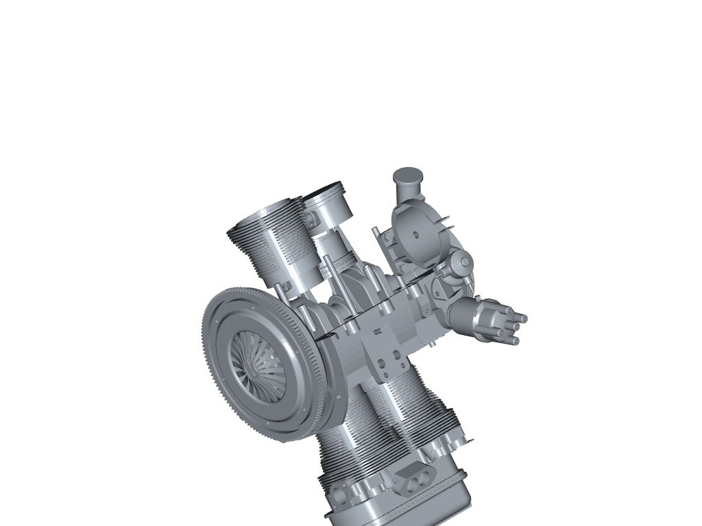
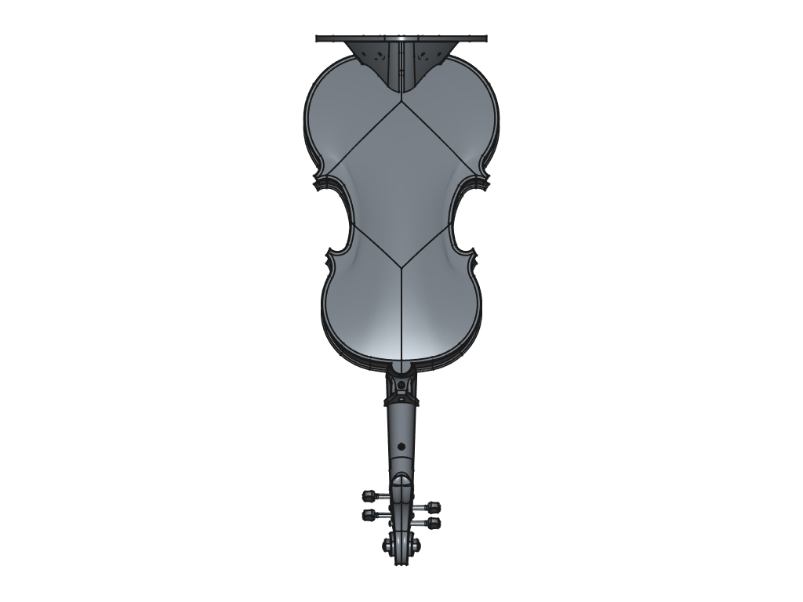
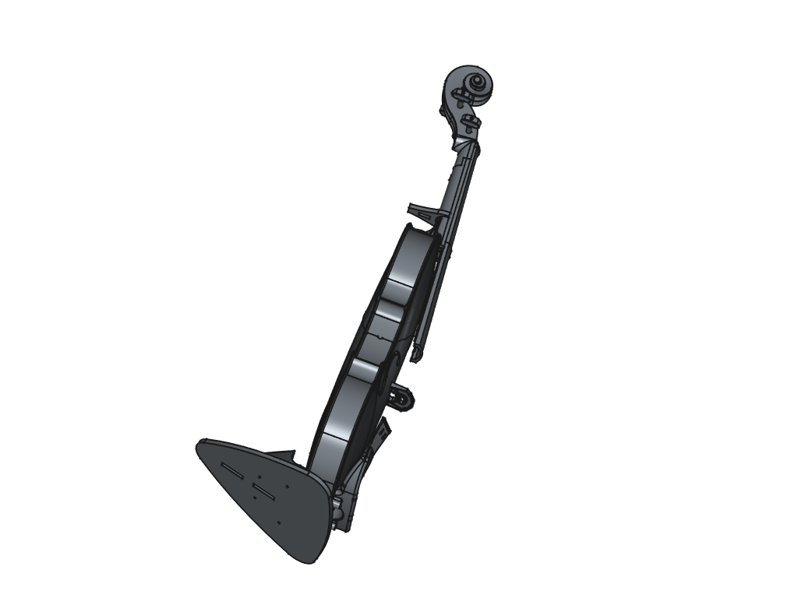

# FreeCAD Multiview Renderer
### Automated Multi-View Rendering for STEP & STL CAD Models Using FreeCAD Python Console


---

## 📌 Overview

**FreeCAD Multiview Renderer** is a lightweight yet powerful automation toolkit designed to generate
**multi-view 2D renderings from 3D CAD models** using **FreeCAD’s built-in Python API**.

This project focuses on **programmatic camera control** and **repeatable view generation** for:

- STEP (B-Rep based CAD models)
- STL (Mesh-based CAD models)

The generated outputs are well-suited for:
- Synthetic dataset generation
- Computer vision & CAD-related ML pipelines
- Documentation visuals
- CAD inspection and analysis

> ⚠️ **IMPORTANT:**  
> All scripts in this repository are intended to be executed **directly inside the FreeCAD Python Console**.  
> Running them via standard Python interpreters is **NOT supported**.

---

## 🎬 Demo (FreeCAD Python Console Execution)

The following demo video shows:

- Executing the Python scripts inside **FreeCAD’s Python Console**
- Automatic camera switching (preset + random views)
- Rendered images being saved to the output directories in real time

📁 Location:
```text
assets/demo/FreeCAD_Multi_View_CAD_Rendering_STEP_STL.mp4
```

> This demo reflects the **exact intended workflow** of the project.

---

## 🎯 Why This Tool Exists

Manual CAD rendering workflows suffer from:

- Inconsistent camera angles
- Time-consuming manual view selection
- Non-reproducible outputs
- Poor suitability for dataset generation

This project solves these issues by providing:

- Deterministic preset views (top, front, left, etc.)
- Randomized camera orientations for diversity
- Scripted, repeatable, dataset-ready outputs
- A clear separation between **inputs**, **outputs**, and **scripts**

---

## 📂 Project Structure

Below is the complete directory layout of **FreeCAD-Multiview-Renderer**:

```text
Freecad-Multiview-Renderer/
├── assets/
│   └── demo/
│       └── FreeCAD_Multi_View_CAD_Rendering_STEP_STL.mp4
│       (Demo video showing script execution inside FreeCAD Python Console)
│
├── data/
│   ├── inputs/
│   │   ├── Flywheel.stl
│   │   │   (Sample STL mesh model)
│   │   └── Violin.step
│   │       (Sample STEP B-Rep CAD model)
│   │
│   └── outputs/
│       ├── 3d_views_Flywheel_stl/
│       │   (Rendered views generated from the STL model)
│       └── 3d_views_Violin_step/
│           (Rendered views generated from the STEP model)
│
├── scripts/
│   ├── freecad_stl_multi_view_renderer.py
│   │   (Multi-view renderer for STL mesh models)
│   └── freecad_step_multi_view_renderer.py
│       (Multi-view renderer for STEP CAD models)
│
└── README.md
```

---

## ⚙️ Execution Workflow (CRITICAL)

### ✅ How the Scripts Are Meant to Be Run

This project **MUST** be executed as follows:

1. Open **FreeCAD**
2. Open the **Python Console** inside FreeCAD
3. Open the desired script from the `scripts/` folder
4. Run the script **inside FreeCAD**

> ❌ Running via:
> - `python script.py`
> - virtual environments
> - IDE run buttons  
> is **not supported**.

This is because the scripts rely on:
- `FreeCAD`
- `FreeCADGui`
- `pivy.coin`

which are only available within the FreeCAD runtime.

---

## 🧠 Script Responsibilities

### 🔹 `freecad_step_multi_view_renderer.py`

- Imports STEP (.step / .stp) CAD models
- Uses B-Rep geometry
- Generates:
  - Isometric view
  - Orthographic views (top, bottom, front, rear, left, right)
  - Randomized camera orientations
- Saves rendered PNG images to:
```text
data/outputs/3d_views_<model>_step/
```

---

### 🔹 `freecad_stl_multi_view_renderer.py`

- Imports STL mesh models
- Operates directly on mesh geometry
- Uses the same camera logic as STEP renderer
- Generates consistent multi-view outputs
- Saves rendered PNG images to:
```text
data/outputs/3d_views_<model>_stl/
```

---

## 🖼️ Sample Rendered Outputs

Below are **representative examples** from the generated outputs.

### 🔹 STL Model (Flywheel) – Two Different Views

Isometric View:


Top View:


---

### 🔹 STEP Model (Violin) – Two Different Views

Front View:


Random View:


> These examples demonstrate:
> - Consistent framing
> - Stable camera positioning
> - Clean background
> - Dataset-ready image quality

---

## 🧪 Typical Use Cases

This project is well-suited for:

- Synthetic CAD dataset generation
- Computer vision research
- CAD-to-image pipelines
- Multi-view learning (NeRF, 3D reconstruction)
- Academic experiments
- Industrial CAD inspection
- Automated documentation rendering

---

## 🧩 Design Philosophy

- FreeCAD-native execution
- Explicit and readable scripts
- Deterministic + stochastic camera control
- Clear separation of concerns
- Dataset-first mindset
- No external rendering engines
- No hidden magic

---

## 👤 Author

**Furkan Karakaya**  
AI & Computer Vision Engineer  

📧 se.furkankarakaya@gmail.com  

---

⭐ If this project helps your workflow or research, consider starring the repository.
